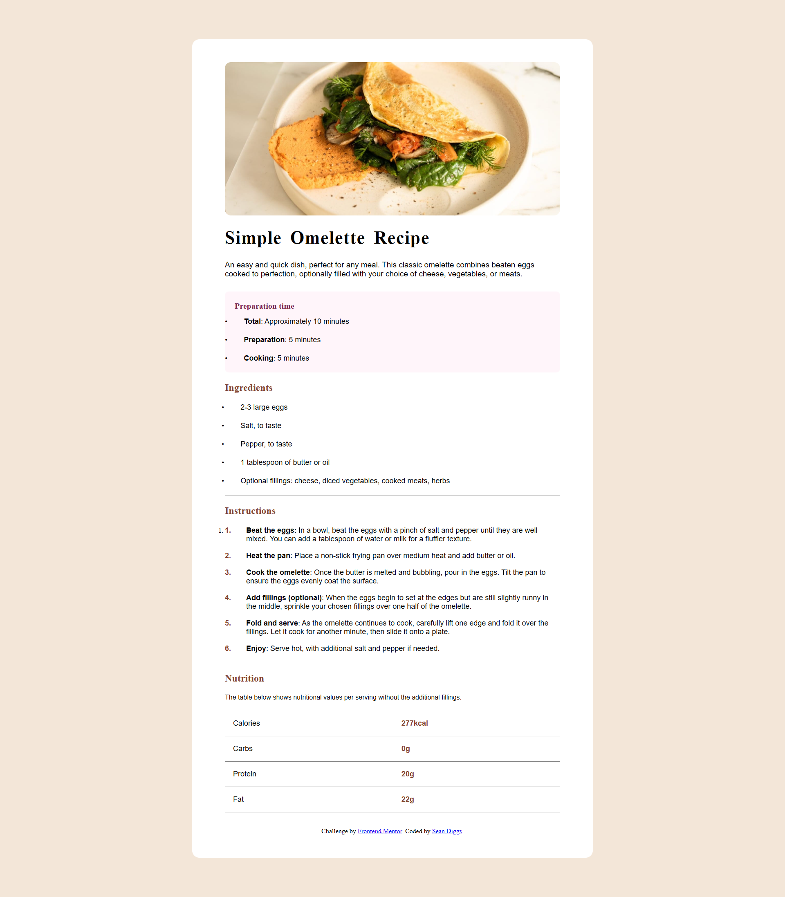

# 🍳 Recipe Page Project

A responsive and beautifully styled recipe page built with HTML5 and CSS3. This project demonstrates semantic HTML structure, modern CSS techniques (including Flexbox and media queries), and thoughtful responsive design for multiple screen sizes.

## 📸 Preview

  

---

## 🧑‍🍳 Features

- Fully responsive layout for mobile, tablet, and desktop screens
- Clean, semantic HTML structure
- Custom font integration with Google Fonts
- CSS Flexbox for layout alignment
- Media queries for screen-based adjustments
- Accessible list formatting with custom bullets
- Styled nutritional facts table

---

## 🛠️ Built With

- **HTML5**
- **CSS3**
- Google Fonts (`Young Serif`, `Outfit`)
- [Front-End Mentor Challenge](https://www.frontendmentor.io) *(optional if this is inspired by or based on one)*

---

## 📁 Folder Structure

Recipe_Page/
└── recipe-page-main/
    ├── index.html
    ├── README.md
    ├── README-template.md
    ├── style-guide.md
    ├── CSS/
    │   └── style.css
    ├── assets/
    │   ├── fonts/
    │   │   ├── outfit/
    │   │   │   ├── static/
    │   │   │   │   ├── Outfit-Black.ttf
    │   │   │   │   ├── Outfit-Bold.ttf
    │   │   │   │   ├── Outfit-ExtraBold.ttf
    │   │   │   │   ├── Outfit-ExtraLight.ttf
    │   │   │   │   ├── Outfit-Light.ttf
    │   │   │   │   ├── Outfit-Medium.ttf
    │   │   │   │   ├── Outfit-Regular.ttf
    │   │   │   │   ├── Outfit-SemiBold.ttf
    │   │   │   │   └── Outfit-Thin.ttf
    │   │   │   ├── Outfit-VariableFont_wght.ttf
    │   │   │   ├── OFL.txt
    │   │   │   └── README.txt
    │   │   └── young-serif/
    │   │       ├── YoungSerif-Regular.ttf
    │   │       └── OFL.txt
    │   └── images/
    │       ├── favicon-32x32.png
    │       └── image-omelette.jpeg
    └── design/
        ├── desktop-design.jpg
        ├── mobile-design.jpg
        └── RecipePage.png

---

## 🚀 Getting Started

To view this project locally:

1. Clone the repository  
   `git clone https://github.com/shondii-fed/recipe-page.git`

2. Navigate into the project folder  
   `cd recipe-page`

3. Open the `index.html` file in your browser

---

## 🔧 Future Improvements

- Add dark mode toggle
- Improve accessibility (ARIA labels, keyboard nav)
- Add animations or transitions
- Implement with a front-end framework like React (for practice)

---

## 🧠 What I Learned

- I learned that using semantics really help make the CSS portion much easier to deal with
- Doing this project, also helped me to notice on things I could improve on for the next project
- Structuring HTML semantically for better accessibility and maintainability
- Using media queries to handle multiple breakpoints
- Creating custom list styles with pseudo-elements
- Making layouts flexible and responsive with pure CSS

---

## 📬 Contact

Made with ❤️ by **[Sean Diggs]**  
[Portfolio](https://yourportfolio.com) | [GitHub](https://github.com/shondii-fed) | [LinkedIn](https://twitter.com/yourhandle)

---

## 📄 License

This project is licensed under the MIT License.